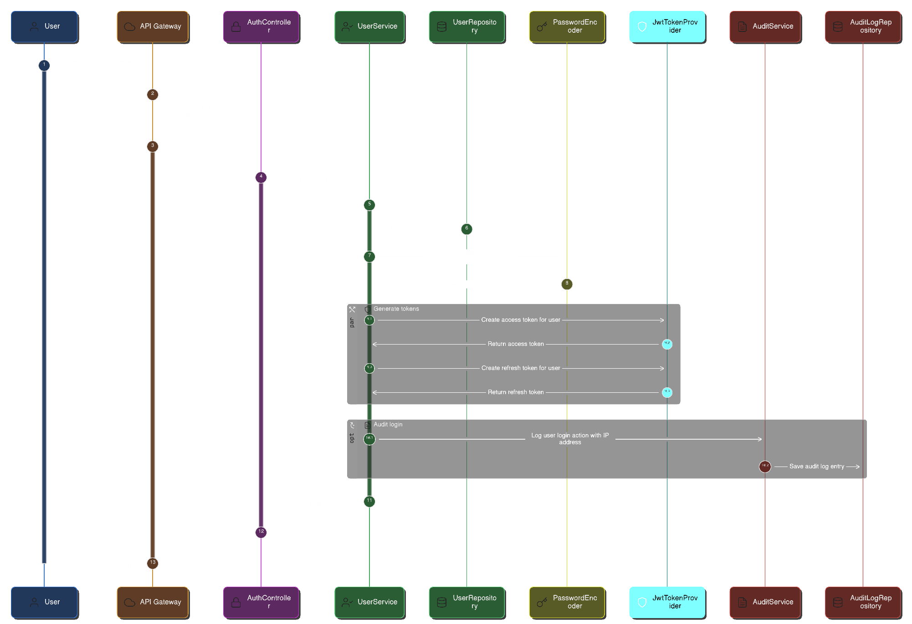

# Low-Level Design (LLD) - TeleTrack360

## 1. Package Structure

### 1.1 Standard Maven Multi-Module Structure

```
teletrack360/
├── pom.xml (parent)
├── common-utils/ (shared library module)
│   └── src/main/java/com/teletrack360/shared/
│       ├── dto/              # Shared DTOs (request/response objects)
│       ├── exception/        # Shared custom exceptions
│       ├── event/            # Kafka event models
│       └── util/             # Shared utility classes
├── discovery/
├── config/
├── gateway/
├── services/
   ├── user-service/
   ├── incident-service/
   ├── notification-service/
   ├── reporting-service/
|── ai-service/ (Python Flask)
```

### 1.2 Microservice Package Layout

```
src/main/java/com/teletrack360/services/{service-name}/
├── config/              # Spring configuration classes
├── controller/          # REST API endpoints
├── entity/              # JPA entities / MongoDB documents
├── repository/          # Data access layer
├── service/             # Business logic
├── mapper/              # DTO ↔ Entity conversion
├── security/            # Security configurations (filters, JWT provider)
└── util/                # Service-specific utilities
```

### 1.3 Shared Common-Utils Module

```
src/main/java/com/teletrack360/shared/
├── dto/
│   ├── request/         # Request DTOs
│   │   ├── LoginRequest.java
│   │   ├── UserRegistrationRequest.java
│   │   ├── IncidentCreateRequest.java
│   │   └── IncidentUpdateRequest.java
│   ├── response/        # Response DTOs
│   │   ├── ApiResponse.java
│   │   ├── JwtResponse.java
│   │   ├── UserResponse.java
│   │   ├── IncidentResponse.java
│   │   └── ReportResponse.java
│   └── pagination/
│       └── PageResponse.java
├── exception/
│   ├── TeleTrackException.java (base)
│   ├── ResourceNotFoundException.java
│   ├── ValidationException.java
│   ├── AuthorizationException.java
│   └── ServiceCommunicationException.java
├── event/
│   ├── IncidentCreatedEvent.java
│   ├── IncidentUpdatedEvent.java
│   ├── IncidentResolvedEvent.java
│   └── IncidentClosedEvent.java
└── util/
    ├── CorrelationIdUtil.java
    └── DateTimeUtil.java
```

**Dependency Management:**
- All services depend on `common-utils` module
- Version: `<common-utils.version>1.0.0</common-utils.version>` in parent POM
- When common-utils changes, increment version and rebuild dependent services

---

## 2. User Service - Component Design

### 2.1 Class Diagram

**Key Classes:**

**Entity: User**
```
+---------------------+
|       User          |
+---------------------+
| - id: UUID          |
| - username: String  |
| - email: String     |
| - passwordHash: String |
| - firstName: String |
| - lastName: String  |
| - role: UserRole    |
| - isActive: Boolean |
| - isApproved: Boolean |
| - createdAt: LocalDateTime |
| - updatedAt: LocalDateTime |
+---------------------+
```

**Entity: AuditLog**
```
+---------------------+
|     AuditLog        |
+---------------------+
| - id: UUID          |
| - userId: UUID      |
| - action: String    |
| - ipAddress: String |
| - timestamp: LocalDateTime |
| - details: String   |
+---------------------+
```

**Enum: UserRole**
```
+---------------------+
|     UserRole        |
+---------------------+
| ADMIN               |
| OPERATOR            |
| SUPPORT             |
+---------------------+
```

**Controller: AuthController**
```
+--------------------------------+
|      AuthController            |
+--------------------------------+
| - userService: UserService     |
+--------------------------------+
| + register(request): ApiResponse<UserResponse>  |
| + login(request): ApiResponse<JwtResponse>      |
| + refresh(token): ApiResponse<JwtResponse>      |
| + logout(): ApiResponse<Void>  |
+--------------------------------+
```

**Service: UserService**
```
+-------------------------------------+
|          UserService                |
+-------------------------------------+
| - userRepository: UserRepository    |
| - passwordEncoder: PasswordEncoder  |
| - auditService: AuditService        |
| - jwtTokenProvider: JwtTokenProvider |
+-------------------------------------+
| + registerUser(request): UserResponse |
| + authenticateUser(request, ip): JwtResponse |
| + refreshToken(token): JwtResponse  |
| + getUserById(id): UserResponse     |
| + approveUser(id): UserResponse     |
+-------------------------------------+
```

**Security: JwtTokenProvider**
```
+----------------------------------+
|      JwtTokenProvider            |
+----------------------------------+
| - jwtSecret: String              |
| - accessTokenExpiration: long    |
| - refreshTokenExpiration: long   |
+----------------------------------+
| + generateAccessToken(user): String    |
| + generateRefreshToken(user): String   |
| + validateToken(token): Boolean  |
| + getUserIdFromToken(token): UUID |
| + getRoleFromToken(token): UserRole |
| + isTokenExpired(token): Boolean |
+----------------------------------+
```

### 2.2 Database Schema (PostgreSQL)

**Table: users**
```sql
CREATE TABLE users (
    id                UUID PRIMARY KEY DEFAULT gen_random_uuid(),
    username          VARCHAR(50) UNIQUE NOT NULL,
    email             VARCHAR(100) UNIQUE NOT NULL,
    password_hash     VARCHAR(255) NOT NULL,
    first_name        VARCHAR(50) NOT NULL,
    last_name         VARCHAR(50) NOT NULL,
    role              VARCHAR(20) NOT NULL CHECK (role IN ('ADMIN', 'OPERATOR', 'SUPPORT')),
    is_active         BOOLEAN NOT NULL DEFAULT TRUE,
    is_approved       BOOLEAN NOT NULL DEFAULT FALSE,
    created_at        TIMESTAMP NOT NULL DEFAULT CURRENT_TIMESTAMP,
    updated_at        TIMESTAMP NOT NULL DEFAULT CURRENT_TIMESTAMP
);

CREATE INDEX idx_users_username ON users(username);
CREATE INDEX idx_users_email ON users(email);
CREATE INDEX idx_users_role ON users(role);
CREATE INDEX idx_users_is_active ON users(is_active, is_approved);
```

**Table: audit_logs**
```sql
CREATE TABLE audit_logs (
    id          UUID PRIMARY KEY DEFAULT gen_random_uuid(),
    user_id     UUID NOT NULL REFERENCES users(id),
    action      VARCHAR(50) NOT NULL,
    ip_address  VARCHAR(45),
    timestamp   TIMESTAMP NOT NULL DEFAULT CURRENT_TIMESTAMP,
    details     TEXT
);

CREATE INDEX idx_audit_logs_user_id ON audit_logs(user_id);
CREATE INDEX idx_audit_logs_timestamp ON audit_logs(timestamp DESC);
CREATE INDEX idx_audit_logs_action ON audit_logs(action);
```

### 2.3 Sequence Diagram: User Login Flow

<p align="center" style="background-color: #1e1e1e; padding: 20px;">
  
</p>


### 2.4 API Endpoints

**User Service Internal Endpoints (after Gateway rewrite):**
```
POST   /auth/register
POST   /auth/login
POST   /auth/refresh
POST   /auth/logout

GET    /users/{id}              [Scope: read]
GET    /users/me                [Scope: read]
PUT    /users/{id}              [Scope: write, Role: ADMIN]
PUT    /users/{id}/approve      [Scope: admin, Role: ADMIN]
DELETE /users/{id}              [Scope: admin, Role: ADMIN]
GET    /users?role={role}       [Scope: read, Role: ADMIN]
```

**External Access (via Gateway):**
```
POST   /api/v1/auth/register
POST   /api/v1/auth/login
POST   /api/v1/auth/refresh
POST   /api/v1/auth/logout

GET    /api/v1/users/{id}
GET    /api/v1/users/me
...
```

### 2.5 Shared DTO Specifications (from common-utils)

**LoginRequest** (com.teletrack360.shared.dto.request)
```
{
  "username": "string (required, 3-50 chars)",
  "password": "string (required, 8-100 chars)"
}
```

**JwtResponse** (com.teletrack360.shared.dto.response)
```
{
  "accessToken": "string (JWT, expires in 15 minutes)",
  "refreshToken": "string (JWT, expires in 7 days)",
  "tokenType": "Bearer",
  "user": {
    "id": "uuid",
    "username": "string",
    "email": "string",
    "firstName": "string",
    "lastName": "string",
    "role": "ADMIN|OPERATOR|SUPPORT"
  }
}
```

**UserRegistrationRequest** (com.teletrack360.shared.dto.request)
```
{
  "username": "string (required, 3-50 chars, unique)",
  "email": "string (required, valid email, unique)",
  "password": "string (required, 8-100 chars)",
  "firstName": "string (required)",
  "lastName": "string (required)",
  "role": "ADMIN|OPERATOR|SUPPORT (required)"
}
```

**ApiResponse<T>** (com.teletrack360.shared.dto.response)
```
{
  "status": "success|error",
  "data": T,
  "message": "string (optional)",
  "errorCode": "string (optional)",
  "correlationId": "string",
  "timestamp": "ISO-8601 datetime"
}
```

---

## 3. API Gateway Configuration

### 3.1 Corrected application.yml

```yaml
server:
  port: 8080

spring:
  application:
    name: api-gateway
  cloud:
    gateway:
      discovery:
        locator:
          enabled: true
          lower-case-service-id: true
      routes:
        # User Service - Auth Routes
        - id: user-service-auth
          uri: lb://user-service
          predicates:
            - Path=/api/v1/auth/**
          filters:
            - RewritePath=/api/v1/auth/(?<segment>.*), /auth/${segment}
            - AddRequestHeader=X-Gateway-Key, ${gateway.service.key}
            - name: CircuitBreaker
              args:
                name: userServiceCircuitBreaker
                fallbackUri: forward:/fallback/users

        # User Service - Users Routes
        - id: user-service-users
          uri: lb://user-service
          predicates:
            - Path=/api/v1/users/**
          filters:
            - RewritePath=/api/v1/users/(?<segment>.*), /users/${segment}
            - AddRequestHeader=X-Gateway-Key, ${gateway.service.key}
            - name: CircuitBreaker
              args:
                name: userServiceCircuitBreaker
                fallbackUri: forward:/fallback/users

        # Incident Service Routes
        - id: incident-service
          uri: lb://incident-service
          predicates:
            - Path=/api/v1/incidents/**
          filters:
            - RewritePath=/api/v1/incidents/(?<segment>.*), /incidents/${segment}
            - AddRequestHeader=X-Gateway-Key, ${gateway.service.key}
            - name: CircuitBreaker
              args:
                name: incidentServiceCircuitBreaker
                fallbackUri: forward:/fallback/incidents

        # Reporting Service Routes
        - id: reporting-service
          uri: lb://reporting-service
          predicates:
            - Path=/api/v1/reports/**
          filters:
            - RewritePath=/api/v1/reports/(?<segment>.*), /reports/${segment}
            - AddRequestHeader=X-Gateway-Key, ${gateway.service.key}
            - name: CircuitBreaker
              args:
                name: reportingServiceCircuitBreaker
                fallbackUri: forward:/fallback/reporting

        # Notification Service Routes
        - id: notification-service
          uri: lb://notification-service
          predicates:
            - Path=/api/v1/notifications/**
          filters:
            - RewritePath=/api/v1/notifications/(?<segment>.*), /notifications/${segment}
            - AddRequestHeader=X-Gateway-Key, ${gateway.service.key}

# Gateway Service Key (for service-to-service auth)
gateway:
  service:
    key: ${GATEWAY_SERVICE_KEY:sk_gateway_default_key_change_in_prod}

# Eureka Client Configuration
eureka:
  client:
    service-url:
      defaultZone: ${EUREKA_CLIENT_SERVICEURL_DEFAULTZONE:http://localhost:8761/eureka/}
    register-with-eureka: true
    fetch-registry: true
  instance:
    prefer-ip-address: true
    instance-id: ${spring.application.name}:${random.value}

# Resilience4J Circuit Breaker Configuration
resilience4j:
  circuitbreaker:
    instances:
      userServiceCircuitBreaker:
        sliding-window-size: 10
        failure-rate-threshold: 50
        wait-duration-in-open-state: 30s
        permitted-number-of-calls-in-half-open-state: 3
        slow-call-duration-threshold: 5s
        slow-call-rate-threshold: 60
      incidentServiceCircuitBreaker:
        sliding-window-size: 10
        failure-rate-threshold: 50
        wait-duration-in-open-state: 30s
        permitted-number-of-calls-in-half-open-state: 3
        slow-call-duration-threshold: 5s
        slow-call-rate-threshold: 60
      reportingServiceCircuitBreaker:
        sliding-window-size: 10
        failure-rate-threshold: 50
        wait-duration-in-open-state: 30s
        permitted-number-of-calls-in-half-open-state: 3
        slow-call-duration-threshold: 5s
        slow-call-rate-threshold: 60

# Actuator Configuration
management:
  endpoints:
    web:
      exposure:
        include: health,info,gateway,routes,metrics,prometheus
  health:
    show-details: always
  metrics:
    tags:
      application: ${spring.application.name}

# Logging Configuration
logging:
  level:
    org.springframework.cloud.gateway: DEBUG
    org.springframework.cloud.loadbalancer: DEBUG
```

### 3.2 Key Configuration Changes

1. **Separate routes for /auth and /users**: Better organization
2. **Correct path rewriting**:
    - `/api/v1/auth/login` → `/auth/login`
    - `/api/v1/users/123` → `/users/123`
3. **Added X-Gateway-Key header**: All routes inject gateway service key
4. **Increased wait-duration**: 30 seconds (from 10 seconds)
5. **Added slow-call thresholds**: Monitor slow calls (>5s), open if >60% slow

---

## 4. Feign Client Design

### 4.1 Feign Client Interface

**UserServiceClient** (example in incident-service):
```java
package com.teletrack360.services.incident.client;

import com.teletrack360.shared.dto.response.UserResponse;
import org.springframework.cloud.openfeign.FeignClient;
import org.springframework.web.bind.annotation.GetMapping;
import org.springframework.web.bind.annotation.PathVariable;
import org.springframework.web.bind.annotation.RequestParam;

import java.util.List;
import java.util.UUID;

@FeignClient(
    name = "user-service",
    configuration = FeignConfig.class
)
public interface UserServiceClient {
    
    @GetMapping("/users/{id}")
    UserResponse getUserById(@PathVariable("id") UUID id);
    
    @GetMapping("/users")
    List<UserResponse> getUsersByRole(@RequestParam("role") String role);
    
    @GetMapping("/users/validate/{id}")
    Boolean validateUser(@PathVariable("id") UUID id);
}
```

### 4.2 Feign Configuration

**FeignConfig:**
```java
package com.teletrack360.services.incident.config;

import feign.Logger;
import feign.RequestInterceptor;
import feign.Retryer;
import org.slf4j.MDC;
import org.springframework.beans.factory.annotation.Value;
import org.springframework.context.annotation.Bean;
import org.springframework.context.annotation.Configuration;

@Configuration
public class FeignConfig {
    
    @Value("${service.api-key}")
    private String serviceApiKey;
    
    @Bean
    public RequestInterceptor serviceAuthInterceptor() {
        return requestTemplate -> {
            // Add service authentication key
            requestTemplate.header("X-Service-Key", serviceApiKey);
            
            // Propagate correlation ID
            String correlationId = MDC.get("correlationId");
            if (correlationId != null) {
                requestTemplate.header("X-Correlation-ID", correlationId);
            }
        };
    }
    
    @Bean
    public Retryer retryer() {
        // Retry: 1s, 2s, 4s (exponential backoff, max 3 attempts)
        return new Retryer.Default(1000, 4000, 3);
    }
    
    @Bean
    public Logger.Level feignLoggerLevel() {
        return Logger.Level.FULL;
    }
}
```

**Service Configuration (application.yml):**
```yaml
service:
  api-key: ${SERVICE_API_KEY:sk_incident_service_default_key}

feign:
  client:
    config:
      default:
        connectTimeout: 5000
        readTimeout: 10000
        loggerLevel: full
  circuitbreaker:
    enabled: true
```

### 4.3 Sequence Diagram: Feign Call with Service Auth

<image: Sequence diagram:
1. Incident Service → FeignClient: getUserById(uuid)
2. FeignClient → RequestInterceptor: apply(requestTemplate)
3. RequestInterceptor: Add X-Service-Key header
4. RequestInterceptor: Add X-Correlation-ID from MDC
5. FeignClient → Eureka: Discover user-service instances
6. Eureka → FeignClient: [instance1:8081, instance2:8082]
7. FeignClient → LoadBalancer: Select instance (round-robin)
8. LoadBalancer → FeignClient: instance1:8081
9. FeignClient → User Service: GET /users/{id} (with headers)
10. User Service → ServiceAuthFilter: Validate X-Service-Key
11. ServiceAuthFilter: Key valid → continue
12. User Service → FeignClient: UserResponse
13. FeignClient → Incident Service: UserResponse>

---

## 5. Security Design

### 5.1 JWT Token Structure

**Access Token (15 minutes):**
```
Header:
{
  "alg": "HS512",
  "typ": "JWT"
}

Payload:
{
  "sub": "user-uuid-123456",
  "username": "john.doe",
  "role": "OPERATOR",
  "scopes": ["read", "write"],
  "iat": 1704805845,
  "exp": 1704806745,
  "type": "access"
}

Signature: HMACSHA512(base64(header) + "." + base64(payload), secret)
```

**Refresh Token (7 days):**
```
Payload:
{
  "sub": "user-uuid-123456",
  "type": "refresh",
  "iat": 1704805845,
  "exp": 1705410645
}
```

### 5.2 Service Authentication Filter

**ServiceAuthFilter** (in each microservice):
```
Filter Chain Order:
1. ServiceAuthFilter (order: -100)
2. JwtAuthenticationFilter (order: -50)

Logic:
if (request.path().startsWith("/actuator")) {
    // Health check endpoints - allow without auth
    continue;
}

if (request.header("X-Service-Key") exists) {
    // Service-to-service call (from Feign or Gateway)
    String serviceKey = request.header("X-Service-Key");
    
    if (allowedServiceKeys.contains(serviceKey)) {
        log.info("Service-to-service call authenticated");
        continue;
    } else {
        log.warn("Invalid service key");
        return 401 Unauthorized;
    }
    
} else if (request.header("X-User-Id") && request.header("X-User-Role")) {
    // User request from Gateway (JWT already validated)
    String userId = request.header("X-User-Id");
    String role = request.header("X-User-Role");
    
    SecurityContextHolder.setAuthentication(userId, role);
    continue;
    
} else {
    return 401 Unauthorized;
}
```

**Configuration (application.yml in each service):**
```yaml
service:
  security:
    allowed-keys:
      - ${GATEWAY_SERVICE_KEY:sk_gateway_default}
      - ${INCIDENT_SERVICE_KEY:sk_incident_default}
      - ${NOTIFICATION_SERVICE_KEY:sk_notification_default}
```

---

## 6. Design Patterns Applied

| Pattern | Location | Purpose |
|---------|----------|---------|
| **Repository Pattern** | All services | Data access abstraction |
| **Shared Kernel** | common-utils | Shared DTOs, events, exceptions |
| **DTO Pattern** | common-utils | Decouple API from domain |
| **Factory Pattern** | Mappers | Object creation |
| **Strategy Pattern** | Notifications | Multiple channels |
| **Observer Pattern** | Kafka consumers | Event-driven |
| **Circuit Breaker** | Gateway, Feign | Fault tolerance |
| **Interceptor Pattern** | Feign | Cross-cutting concerns |
| **Event Sourcing** | Incident events | Audit trail |
| **CQRS** | Incident/Reporting | Optimize read/write |

---

## 7. Key Design Decisions

### 7.1 Shared Common-Utils Module
- **Benefit:** DRY principle, consistency
- **Risk:** All services rebuild when changed
- **Mitigation:** Semantic versioning

### 7.2 JWT with Refresh Token
- **Access token:** 15 minutes
- **Refresh token:** 7 days
- **Benefit:** Better security, less re-login

### 7.3 Gateway Path Rewriting
- **Pattern:** `/api/v1/{resource}` → `/{resource}`
- **Benefit:** Services don't know about versioning

### 7.4 Service Authentication
- **Method:** API Keys in X-Service-Key header
- **Benefit:** Simple, sufficient for trusted services
