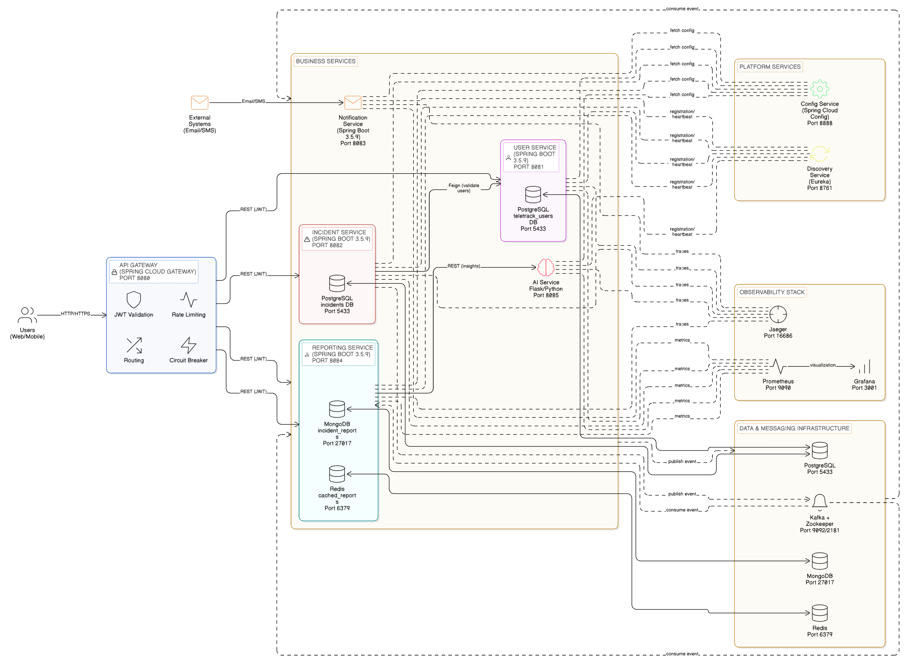

# TeleTrack360 - Incident Management System

> **Modern microservices platform for telecom incident management with real-time notifications and AI-powered analytics**

[](https://openjdk.org/)
[](https://spring.io/projects/spring-boot)
[](https://www.docker.com/)

---

## Architecture Overview

**8 Microservices | Event-Driven | Polyglot Persistence | Cloud-Native**



### Microservices Stack

| Service | Port | Technology | Purpose |
|---------|------|-----------|---------|
| **Discovery** | 8761 | Spring Cloud Eureka | Service registry & health monitoring |
| **Config** | 8888 | Spring Cloud Config | Centralized configuration management |
| **Gateway** | 8080 | Spring Cloud Gateway | Routing, security, circuit breaking, rate limiting |
| **User Service** | 8081 | Spring Boot + PostgreSQL | Authentication, authorization, RBAC |
| **Incident Service** | 8082 | Spring Boot + PostgreSQL | Core domain logic, event sourcing |
| **Notification Service** | 8083 | Spring Boot + Kafka | Multi-channel notifications (Email) |
| **Reporting Service** | 8084 | Spring Boot + MongoDB + Redis | Analytics, caching, aggregations |
| **AI Service** | 8085 | Flask + GPT-4o-mini | Pattern detection & insights |

### Infrastructure

| Component | Port | Purpose |
|-----------|------|---------|
| **PostgreSQL** | 5433 | Transactional data (users, incidents) |
| **MongoDB** | 27017 | Analytics data (denormalized reports) |
| **Redis** | 6379 | Caching (1-hour TTL), rate limiting |
| **Kafka + Zookeeper** | 9092, 2181 | Event streaming (5 topics, 3 partitions) |
| **Prometheus** | 9090 | Metrics scraping (15s interval) |
| **Grafana** | 3001 | Visualization dashboards |
| **Jaeger** | 16686 | Distributed tracing |

---

## Quick Start

### Prerequisites
- **Java 21** or higher
- **Docker** & **Docker Compose**
- **Maven 3.8+**
- **Python 3.11** (for AI service)

### Step 1: Start Infrastructure
```bash
# Clone the repository
git clone https://github.com/mahmoud-47/mohamed-gaye-java-backend-assessment.git
cd teletrack360

# Start all infrastructure containers
docker-compose up -d

# Verify containers are running
docker-compose ps
```

### Step 2: Build & Run Services
```bash
# Build all services (from root)
mvn clean install

# Option 1: Run each service in separate terminals
cd discovery && mvn spring-boot:run
cd config && mvn spring-boot:run
cd gateway && mvn spring-boot:run
cd services/user-service && mvn spring-boot:run
cd services/incident-service && mvn spring-boot:run
cd services/notification-service && mvn spring-boot:run
cd services/reporting-service && mvn spring-boot:run

# Option 2: Run AI service (Python)
cd ai-service
pip install -r requirements.txt
export OPENAI_API_KEY=your-api-key
python app.py
```

### Step 3: Access Applications

- **API Gateway:** http://localhost:8080
- **Swagger UI:** http://localhost:8080/swagger-ui.html
- **Eureka Dashboard:** http://localhost:8761
- **Grafana:** http://localhost:3001 (admin/admin)
- **Prometheus:** http://localhost:9090
- **Jaeger:** http://localhost:16686

---

## Key Features

### Technical Capabilities

-  **Polyglot Persistence**
    - PostgreSQL for ACID transactions (users, incidents)
    - MongoDB for analytics (denormalized reports)
    - Redis for high-speed caching (report results)

-  **Event-Driven Architecture**
    - Kafka streaming with 5 topics
    - Event sourcing for complete audit trails
    - Asynchronous notification processing

-  **Security**
    - OAuth2/JWT authentication
    - 15-minute access tokens + 7-day refresh tokens
    - Role-based access control (ADMIN, OPERATOR, SUPPORT)
    - Service-to-service API key authentication

-  **Resilience**
    - Circuit breaker pattern (Resilience4J)
    - Retry with exponential backoff
    - Rate limiting (100 req/s per service)
    - Bulkhead isolation

-  **Observability**
    - Distributed tracing with Jaeger
    - Metrics collection with Prometheus
    - Visualization with Grafana
    - Centralized logging (structured JSON)

-  **AI Integration**
    - GPT-4o-mini for pattern analysis
    - Automated incident insights
    - Executive report generation
- **CI/CD Pipeline**

---

## 📡 API Endpoints

### Authentication
```bash
# Register new user
POST /api/v1/auth/register
{
  "firstName": "John",
  "lastName": "Doe",
  "email": "john@example.com",
  "password": "SecurePass123",
  "role": "OPERATOR"
}

# Login
POST /api/v1/auth/login
{
  "email": "john@example.com",
  "password": "SecurePass123"
}

# Get current user
GET /api/v1/auth/me
Authorization: Bearer <access-token>

# Refresh token
POST /api/v1/auth/refresh
{
  "refreshToken": "<refresh-token>"
}
```

### Incident Management
```bash
# Create incident
POST /api/v1/incidents
{
  "title": "Network outage in region A",
  "description": "Complete network failure",
  "priority": "HIGH"
}

# Get incident by ID
GET /api/v1/incidents/{id}

# Assign incident
POST /api/v1/incidents/{id}/assign
{
  "assignedTo": "user-uuid"
}

# Change status
PUT /api/v1/incidents/{id}/status?status=IN_PROGRESS

# Get my incidents
GET /api/v1/incidents/my?page=0&size=20

# Get assigned incidents
GET /api/v1/incidents/assigned?page=0&size=20
```

### Reporting & Analytics
```bash
# Get summary statistics
GET /api/v1/reports/summary

# Get trend report
GET /api/v1/reports/trends?startDate=2026-01-01&endDate=2026-01-31

# Get user performance
GET /api/v1/reports/user-performance

# Get AI insights
POST /api/v1/reports/ai-insights

# Get AI summary
POST /api/v1/reports/ai-summary?startDate=2026-01-01&endDate=2026-01-31
```

### Admin Endpoints
```bash
# Get audit logs
GET /api/v1/admin/audit-logs?user={id}&action={action}&date-from={date}&date-to={date}

# Get system statistics
GET /api/v1/admin/stats

# Approve user
PATCH /api/v1/users/{id}/approve

# Deactivate user
PATCH /api/v1/users/{id}/deactivate
```

---

## Testing

### Unit Tests
```bash
# Run all unit tests
mvn test

# Run tests with coverage
mvn test jacoco:report

# View coverage report
open target/site/jacoco/index.html
```

### Integration Tests
```bash
# Run integration tests with Testcontainers
mvn verify -P integration-tests
```

### Coverage Report
```bash
# Generate aggregate coverage report
cd reports/aggregate-report
mvn clean verify

# View report
open target/site/jacoco-aggregate/index.html
```

**Target Coverage:** 80% for all services

---

## Project Structure
```
teletrack360/
├── pom.xml                        # Parent POM
├── docker-compose.yml             # Infrastructure stack
│
├── common-utils/                  # Shared module
│   └── src/main/java/com/teletrack/commonutils/
│       ├── dto/                   # Shared DTOs (request/response)
│       ├── exception/             # Shared exceptions
│       ├── event/                 # Kafka event models
│       └── enums/                 # Shared enums
│
├── discovery/                     # Eureka Server (8761)
├── config/                        # Config Server (8888)
├── gateway/                       # API Gateway (8080)
│
├── services/
│   ├── user-service/              # User management (8081)
│   │   ├── controller/            # REST endpoints
│   │   ├── service/               # Business logic
│   │   ├── repository/            # Data access
│   │   ├── entity/                # JPA entities
│   │   ├── security/              # JWT, OAuth2 config
│   │   └── mapper/                # DTO converters
│   │
│   ├── incident-service/          # Incident management (8082)
│   ├── notification-service/      # Notifications (8083)
│   └── reporting-service/         # Analytics (8084)
│
├── ai-service/                    # Python AI service (8085)
│   ├── app.py                     # Flask application
│   └── requirements.txt           # Python dependencies
│
├── reports/
│   └── aggregate-report/          # JaCoCo aggregate coverage
│
└── docs/
    ├── HLD.md                     # High-Level Design
    ├── LLD.md                     # Low-Level Design
    ├── DATABASE_ENTITIES.md       # Database schemas
    └── imgs/                      # Architecture diagrams
```

---

## 🛠 Technology Stack

### Backend

| Technology | Version | Purpose |
|-----------|---------|---------|
| Java | 21 | Programming language |
| Spring Boot | 3.5.9 | Application framework |
| Spring Cloud | 2025.0.1 | Microservices framework |
| Spring Cloud Gateway | Latest | API Gateway |
| Spring Cloud Netflix Eureka | Latest | Service discovery |
| Spring Cloud Config | Latest | Configuration management |
| Spring Data JPA | Latest | Database abstraction |
| Spring Kafka | Latest | Event streaming |
| Resilience4J | 2.2.0 | Circuit breaker, retry, bulkhead |
| OpenFeign | Latest | Declarative REST client |

### Security

| Technology | Version | Purpose |
|-----------|---------|---------|
| Spring Security | Latest | Authentication & authorization |
| jjwt | 0.12.3 | JWT generation & validation |
| OAuth2 | Latest | OAuth2 integration |

### Data

| Technology | Version | Purpose |
|-----------|---------|---------|
| PostgreSQL | 15 | Relational database |
| MongoDB | 7 | Document database |
| Redis | 7 | In-memory cache |
| Kafka | 3.x | Event streaming |
| Liquibase | 4.25.0 | Schema versioning |

### Observability

| Technology | Version | Purpose |
|-----------|---------|---------|
| Prometheus | Latest | Metrics collection |
| Grafana | Latest | Visualization |
| Jaeger | 1.53 | Distributed tracing |
| OpenTelemetry | Latest | Tracing instrumentation |

### Tools

| Technology | Version | Purpose |
|-----------|---------|---------|
| Lombok | 1.18.36 | Boilerplate reduction |
| Swagger/OpenAPI | Latest | API documentation |
| Maven | 3.9+ | Build tool |
| Docker | Latest | Containerization |

### AI Module

| Technology | Version | Purpose |
|-----------|---------|---------|
| Python | 3.11 | Programming language |
| Flask | Latest | Web framework |
| OpenAI | Latest | GPT-4o-mini integration |

---

## Observability

### Metrics (Prometheus)
```bash
# Access Prometheus
http://localhost:9090

# Key metrics
- http_requests_total
- http_request_duration_seconds
- incidents_created_total
- incidents_resolved_total
- jvm_memory_used_bytes
- resilience4j_circuitbreaker_state
```

### Dashboards (Grafana)
```bash
# Access Grafana
http://localhost:3001
Username: admin
Password: admin

# Pre-configured dashboards
- Service Health (uptime, request rate, error rate)
- Incident Analytics (creation rate, resolution time)
- Infrastructure (CPU, memory, disk)
- Business KPIs (SLA compliance)
```

### Tracing (Jaeger)
```bash
# Access Jaeger UI
http://localhost:16686

# View traces for
- Complete request flows across services
- Bottleneck identification
- Error analysis with context
- Performance comparisons
```

---

## Security

### Authentication Flow

1. User sends credentials to `/api/v1/auth/login`
2. User Service validates credentials (BCrypt)
3. JWT access token generated (15-min expiry)
4. JWT refresh token generated (7-day expiry)
5. Tokens returned to client
6. Client includes access token in `Authorization: Bearer` header
7. Gateway validates JWT and extracts claims
8. Gateway adds `X-User-Id` and `X-User-Role` headers
9. Target service trusts Gateway headers

### Role-Based Access Control

| Action | ADMIN | OPERATOR | SUPPORT |
|--------|-------|----------|---------|
| Manage Users | ✓ | ✗ | ✗ |
| Approve Users | ✓ | ✗ | ✗ |
| Create Incident | ✓ | ✓ | ✓ |
| Update Incident | ✓ | ✓ | ✗ |
| Assign Incident | ✓ | ✓ | ✗ |
| Resolve Incident | ✓ | ✓ | ✗ |
| View All Incidents | ✓ | ✗ | ✗ |
| View Reports | ✓ | ✓ | ✓ |

### Service-to-Service Authentication

- API Key authentication via `X-Service-Key` header
- Gateway injects key for internal calls
- Each service validates incoming service keys
- All inter-service calls audited

---

## CI/CD Pipeline

### GitHub Actions Workflow
```yaml
name: Build & Test

on: [push, pull_request]

jobs:
  build:
    runs-on: ubuntu-latest
    steps:
      - Checkout code
      - Setup Java 21
      - Maven build & test
      - JaCoCo coverage report
      - SpotBugs static analysis
      - Docker image build
      - Push to registry
```

---

## Documentation

### Design Documents

- **[HLD.md](docs/HLD.md)** - High-Level Design
    - System architecture
    - Communication patterns
    - Security design
    - Resilience strategies
    - Observability setup

- **[LLD.md](docs/LLD.md)** - Low-Level Design
    - Package structure
    - Class diagrams
    - Database schemas
    - API specifications
    - Sequence diagrams

- **[DATABASE_ENTITIES.md](docs/DATABASE_ENTITIES.md)**
    - Complete table definitions
    - Indexes and constraints
    - MongoDB collections
    - Redis key patterns

### Architecture Diagrams

- System Context Diagram: `imgs/sys-architecture.png`
- Container Diagram: `imgs/container-diag.png`
- Service Discovery Flow: `imgs/svg-09-service-discovery.svg`
- Circuit Breaker Pattern: `imgs/svg-07-circuit-breaker.svg`
- Observability Stack: `imgs/svg-08-observability-stack.svg`
- Login Sequence: `imgs/login-seq.png`
- Entity Relationship: `imgs/teletrack erd.drawio.png`

---

## Assessment Alignment

### Advanced Level 1 Requirements

✅ **8 Microservices** (Discovery, Config, Gateway, User, Incident, Notification, Reporting, AI)  
✅ **Event Sourcing** (`incident_history` table with complete audit trail)  
✅ **CQRS Pattern** (PostgreSQL for writes, MongoDB for reads)  
✅ **Polyglot Persistence** (PostgreSQL + MongoDB + Redis)  
✅ **Kafka Event Streaming** (5 topics, 3 partitions each)  
✅ **Service Discovery** (Eureka for registration & health checks)  
✅ **API Gateway** (Spring Cloud Gateway with routing & security)  
✅ **Circuit Breaker** (Resilience4J with fallback responses)  
✅ **OAuth2/JWT Security** (15-min access + 7-day refresh tokens)  
✅ **Observability** (Prometheus + Grafana + Jaeger + ELK)  
✅ **AI Integration** (GPT-4o-mini for pattern analysis)  
✅ **Docker Deployment** (Complete Docker Compose stack)  
✅ **Liquibase Migrations** (Schema version control)  
✅ **Swagger Documentation** (OpenAPI 3.0 specs)  
✅ **Comprehensive Testing** (Unit + Integration with 80% coverage)

### Advanced Level 2 Requirements

✅ **Domain-Driven Design** (Bounded contexts, aggregates)  
✅ **Event-Driven Architecture** (Kafka-based async communication)  
✅ **Service Mesh Ready** (Correlation IDs, distributed tracing)  
✅ **Rate Limiting** (Redis-backed token bucket at Gateway)  
✅ **Quality Gates** (JaCoCo + SpotBugs in CI/CD)  
✅ **Centralized Configuration** (Spring Cloud Config with Git backend)  
✅ **Secrets Management** (Environment-based configuration)

---

## Troubleshooting

### Common Issues

**Services can't register with Eureka**
```bash
# Check Eureka is running
curl http://localhost:8761/actuator/health

# Verify network connectivity
docker network inspect teletrack-network
```

**Database connection failed**
```bash
# Check PostgreSQL is running
docker-compose ps postgres

# Verify credentials in application.yml
spring.datasource.url=jdbc:postgresql://localhost:5433/teletrack_users
```

**Kafka consumers not receiving messages**
```bash
# Check Kafka is running
docker-compose ps kafka

# List topics
docker exec -it teletrack-kafka kafka-topics --list --bootstrap-server localhost:9092

# Check consumer group
docker exec -it teletrack-kafka kafka-consumer-groups --describe --group notification-service-group --bootstrap-server localhost:9092
```

**Circuit breaker always open**
```bash
# Check service health
curl http://localhost:8081/actuator/health

# View circuit breaker metrics
curl http://localhost:8080/actuator/metrics/resilience4j.circuitbreaker.state
```

---

## Contributing

1. Fork the repository
2. Create feature branch (`git checkout -b feature/amazing-feature`)
3. Commit changes (`git commit -m 'Add amazing feature'`)
4. Push to branch (`git push origin feature/amazing-feature`)
5. Open Pull Request

---

## Contact

**Mohammed** - Java Backend Engineer  
Email: mohamedgaye.mhd@gmail.com

---

## License

This project is licensed under the MIT License - see the [LICENSE](LICENSE) file for details.

---

## Acknowledgments

- Spring Framework Team
- Apache Kafka Community
- Resilience4J Contributors
- OpenTelemetry Project

---

**TeleTrack360** | *Next-Generation Telecom Operations Platform*  
*Modernizing incident management with microservices, AI, and cloud-native architecture*